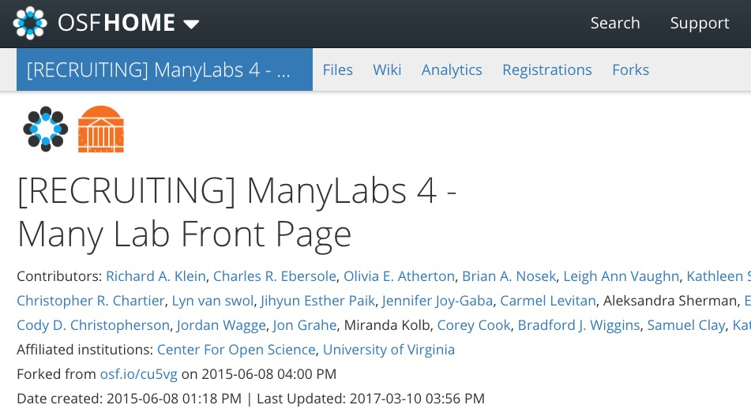
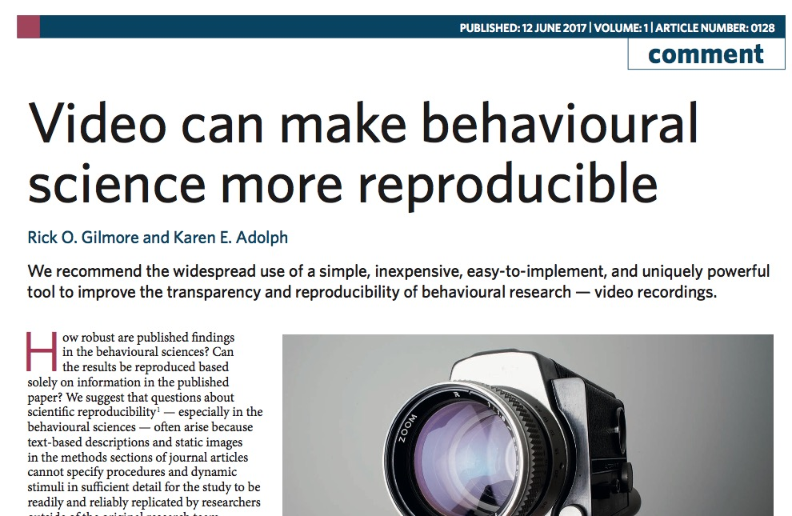

```{r setup, include=FALSE}
knitr::opts_chunk$set(echo = FALSE)
```


</br>


<div class="notes">
</div>

## Video provides uniquely rich data about behavior

---

<div>
<video width="720" height="450" controls>
  <source src="https://nyu.databrary.org/slot/10070/678266,710826/asset/28131/download?inline=true" type="video/mp4">
Your browser does not support the video tag.
</video>

Franchak, J. & Adolph, K. (2015). Free viewing gaze behavior in infants and adults. Databrary. Retrieved August 1, 2017 from http://doi.org/10.17910/B7.192
</div>

## Video can demonstrate findings

---

<div>
<video width="720" height="450" controls>
  <source src="https://nyu.databrary.org/slot/9850/-/asset/11550/download?inline=true" type="video/mp4">
Your browser does not support the video tag.
</video>

DeLoache, J. (2014). Scale errors offer evidence for a perception-action dissociation early in life. Databrary. Retrieved August 1, 2017 from http://doi.org/10.17910/B7H019.
</div>

## Video can document procedures

---

<div>
<video width="720" height="450" controls>
  <source src="https://www.databrary.org/video/example-video-2.mp4" type="video/mp4">
Your browser does not support the video tag.
</video>
</div>

---

<div class="centered">


<https://dev1.ed-projects.nyu.edu/wikis/docuwiki/doku.php/landing>
</div>

---

<div class="centered">



Many Labs 4, https://osf.io/ph29u/
</div>

## Video can depict displays

---

<div>
<video width="720" height="450" controls>
  <source src="https://nyu.databrary.org/slot/9809/-/asset/11354/download?inline=true" type="video/mp4">
Your browser does not support the video tag.
</video>

Naigles, L. (2014). Children use syntax to learn verb meanings. Databrary. Retrieved August 1, 2017 from http://doi.org/10.17910/B7J01M.
</div>

---

<div class="centered">
<a href="http://doi.org/10.1038/s41562-017-0128">

</a>

[Gilmore & Adolph 2017](http://doi.org/10.1038/s41562-017-0128)
</div>

## Let's improve the reproducibility of psychological science through shared video

@rogilmore</br>
[gilmore-lab-github.io/sips-2017-video-reproducbility](http://gilmore-lab-github.io/sips-2017-video-reproducbility)

## Stack

This talk was produced on `r Sys.time()` in [RStudio 1.0.143](http://rstudio.com) using R Markdown and the reveal.JS framework.
The code and materials used to generate the slides may be found at <https://github.com/gilmore-lab/sips-2017-video-reproducibility/>. 
Information about the R Session that produced the code is as follows:

---

```{r session-info}
sessionInfo()
```
